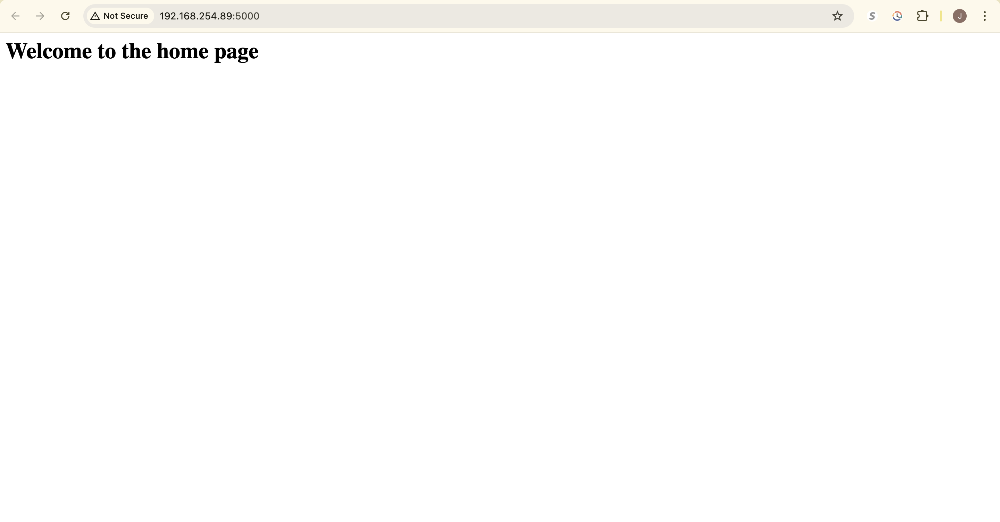
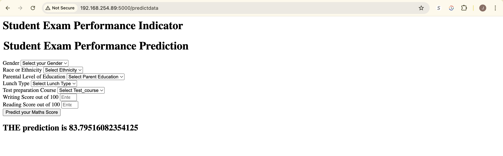

# Student Performance Prediction with AWS Deployment

**A full-stack machine learning application that predicts student math scores based on demographics and test performance.**

This project combines a clean ML pipeline, model comparison, and a user-friendly Flask interface—**deployed on AWS Elastic Beanstalk** for seamless scalability and accessibility.

---

## Features

* **EDA & Modeling:** Performed in Jupyter notebooks for clarity.
* **Modular ML Pipeline:** Includes ingestion, transformation, training, and prediction logic.
* **Model Comparison:** Uses XGBoost, CatBoost, Random Forest, and others with hyperparameter tuning.
* **Flask Web Interface:** Clean HTML form to collect input and display predictions.
* **Deployed on AWS:** Hosted using **AWS Elastic Beanstalk** with Docker support.

---

## Project Structure

```
.
├── app.py                      
├── src/                        # Core ML components and pipelines
│   ├── component/              # data_ingestion, data_transformation, model_trainer
│   ├── pipeline/               # predict_pipeline, train_pipeline
│   └── utils.py, logger.py, exception.py
├── notebooks/                  # EDA and model building
│   ├── data/stud.csv
│   ├── 1. EDA.ipynb
│   └── 2. Model_Training.ipynb
├── templates/                  # HTML templates for Flask
├── Dockerfile                  # Dockerfile for deployment
├── setup.py                    # Setup script
├── requirements.txt            # Python dependencies
└── .github/workflows/          # GitHub Actions (CI)
```

---

## How to Run Locally

### 1. Clone the Repository

```bash
git clone https://github.com/your-username/student-performance-prediction.git
cd student-performance-prediction
```

### 2. Install Requirements

```bash
pip install -r requirements.txt
```

### 3. Start the Flask App

```bash
python app.py
```

---

### `Home Page`

User form for entering prediction data:



### `Prediction Page`



## Deployed on AWS Elastic Beanstalk

This application is packaged using a `Dockerfile` and deployed on **AWS Elastic Beanstalk**.

---

## ML Model Info

* **Target Variable:** `math_score`
* **Input Features:**

  * Gender, Ethnicity, Parental Education
  * Lunch Type, Test Preparation
  * Reading and Writing Scores
* **Best Model:** Automatically selected based on R² score from a range of regressors.

---

## To-Do / Enhancements

* Add prediction endpoints for all subjects.
* Improve UI with better form validation.

---
